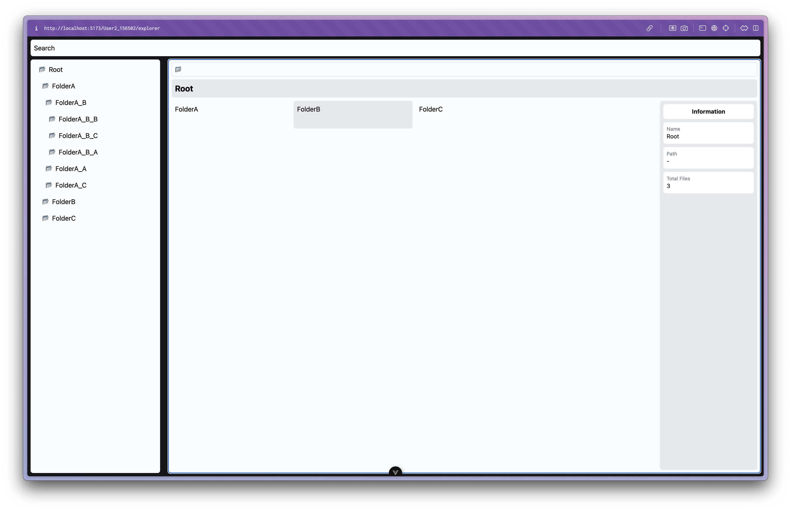

# Elysia - Vue - File Explorer


A simple file explorer using Elysia as backend and Vue as frontend.

## How to run

* On root folder run `bun run dev:all`
    >  These will start the backend and frontend and start the database.
* Or you may run the backend and frontend separately:
    * Run the backend with `bun run dev:backend`
    * Run the frontend with `bun run dev:frontend`
    * Run the database with `bun run db:start`
        > makesure to have docker compose compatible with your machine
* Connect to the database and create the schema with `explorer`
    * you can use psql or any favorite tool to connect to the database
* Run the migration with `bun run db:migrate`

## How to use
Open the frontend in your browser at `http://localhost:5173

## Implemented Features 
* Swagger
* Support multiple users
* Use PrimeVue components
* Use Elysia as backend
* Use Vue as frontend
* Use Drizzle as ORM
* Use Drizzle Studio as database tool
* Use Bun as runtime
* Use Docker as database container
* Use NPM workspaces to manage the project
* Unit Test
    * Bun Test for backend
        ```
        bun test:backend
        ```
* search (TODO)

## Tech Stack & Libraries
* NPM workspaces
* Bun
* Elysia
* Elysia Eden
* Drizzle
* Vue 3
* Vite
* PrimeVue

## Folder Structure
```
.
├── apps/backend
│   ├── migrations - migrations file
│   ├── src
│   │   ├── handler 
│   │   │   ├── handler.ts - "api/v1" route group 
│   │   │   ├── folderHandler - controller for folder
│   │   │   └── userHandler - controller for user
│   │   ├── model - service / usecase type definition
│   │   ├── repository - repository layer
│   │   │   ├── user
│   │   │   └── folder
│   │   ├── schema - drizzle schema definitions
│   │   ├── service - service class
│   │   │   └── folder
│   │   └── shared - helper & common called function
│   │       ├── database - singleton db connection
│   │       └── schema
│   └── main.ts
├── apps/frontend
│   ├── src
│   │   ├── assets
│   │   ├── components
│   │   ├── provider
│   │   ├── repository - data source fetcher (not used utilizing eden)
│   │   ├── router
│   │   ├── types
│   │   ├── views 
│   │   └── app.vue
│   └── main.ts
└── package
    ├── libs - shared libs 
    │   └── src
    │       ├── eden.ts
    │       └── index.ts
    └── tsconfig - shared tsconfig file
```